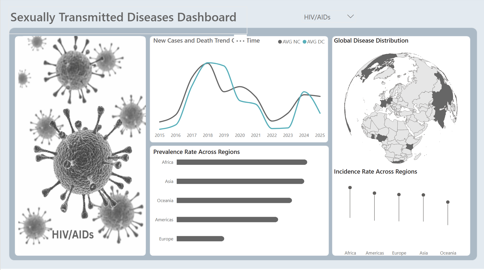

# 🦠 STD Global Dashboard

Power BI Dashboard Project | Global Public Health Analysis | 4 Diseases | Regional Trends

## 📚 Table of Contents
- [Project Overview](#project-overview)
- [Tools & Technologies](#tools--technologies)
- [Dataset Breakdown](#dataset-breakdown)
- [Dashboard Walkthrough](#dashboard-walkthrough)
- [Key Insights & Findings](#key-insights--findings)
- [Recommendations](#recommendations)

---

## Project Overview

This self-initiated project builds an interactive Power BI dashboard 
exploring global sexually transmitted disease trends, regional prevalence 
and outbreak patterns across four major diseases — HIV, Hepatitis B, HPV 
and Syphilis.

The goal was to transform complex epidemiological data into clear visual 
insights that support public health monitoring and preventive 
decision-making. The dashboard is designed to make sensitive, real-world 
health data accessible and meaningful to both specialist and 
non-specialist audiences.

---

## Tools & Technologies

- Power BI — interactive dashboard design and reporting
- DAX — measures and calculated fields
- Power Query — data cleaning and transformation

---

## Dataset Breakdown

- 4 diseases — HIV, Hepatitis B, HPV, Syphilis
- Global coverage — Africa, Asia, Americas, Europe, Oceania
- New case trends — tracked over time from 2015 to 2025
- Death rate trends — tracked alongside new cases over time
- Regional prevalence rates — by global region
- Incidence rates — comparative across regions
- Global distribution map — geographic spread visualisation

---

## Dashboard Walkthrough

### Dashboard — Disease Trends & Regional Distribution

The dashboard is filterable by disease type — HIV, Hepatitis B, HPV and 
Syphilis — allowing each disease to be analysed independently using the 
same visual framework.

For Syphilis (shown): the new cases and death trend chart tracks average 
new cases and average death counts from 2015 to 2025, revealing the 
relationship between outbreak peaks and mortality response. The 
prevalence rate chart shows Africa carrying the highest regional burden 
by a significant margin, followed by Asia, the Americas and Europe, 
with Oceania having the lowest prevalence. The global distribution map 
provides geographic context for the regional data, and the incidence 
rate chart compares regional rates side by side for direct comparison.

---

## Key Insights & Findings

1. **Africa carries the highest disease burden across all regions** — 
prevalence rates in Africa significantly outpace all other regions for 
Syphilis, consistent with broader global health data on STD distribution. 
This pattern holds across the other diseases available in the filter.

2. **New case trends and death rates do not always move together** — 
the trend chart reveals periods where death rates spike independently 
of new case volumes, suggesting healthcare system capacity and treatment 
access play a significant role beyond infection rates alone.

3. **Oceania consistently records the lowest prevalence and incidence** 
— across all regions Oceania sits at the bottom of both metrics, 
indicating either lower actual prevalence or lower reporting and 
detection rates.

4. **The dashboard reveals regional inequality in disease burden** — 
the concentration of cases in Africa and Asia versus Europe and Oceania 
reflects broader inequalities in healthcare access, prevention 
infrastructure and reporting systems.

---

## Recommendations

1. **Prioritise Africa and Asia for global intervention resources** — 
the consistently higher prevalence and incidence rates in these regions 
indicate where targeted prevention campaigns, treatment access programmes 
and healthcare infrastructure investment would have the greatest impact.

2. **Investigate death rate spikes independent of case volume** — 
periods where mortality rises without a corresponding rise in new cases 
may indicate healthcare system strain or treatment access failures 
that warrant deeper investigation.

3. **Improve reporting and detection in Oceania** — the consistently 
low figures may reflect underreporting rather than genuine low 
prevalence. Strengthening surveillance systems would provide a more 
accurate global picture.

4. **Use the multi-disease filter for comparative policy analysis** — 
policymakers can use the dashboard to compare regional burden across 
all four diseases simultaneously, supporting more holistic public 
health strategy rather than single-disease focused interventions.
